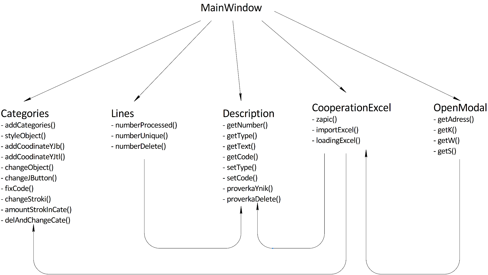
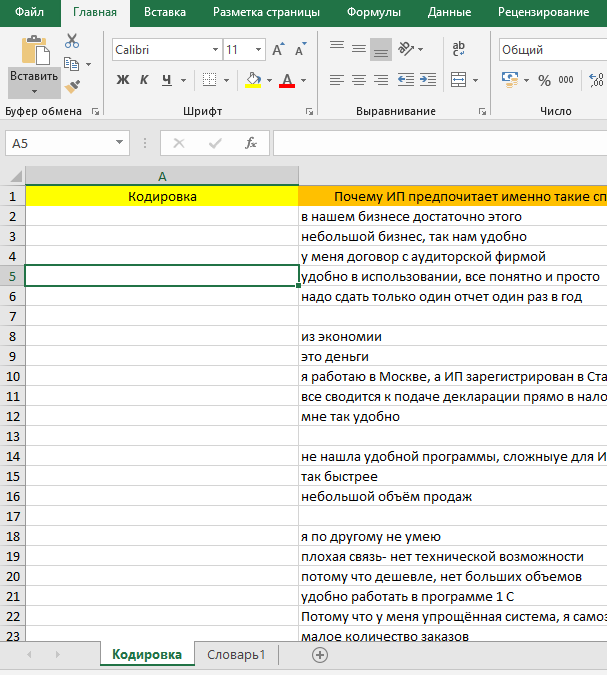
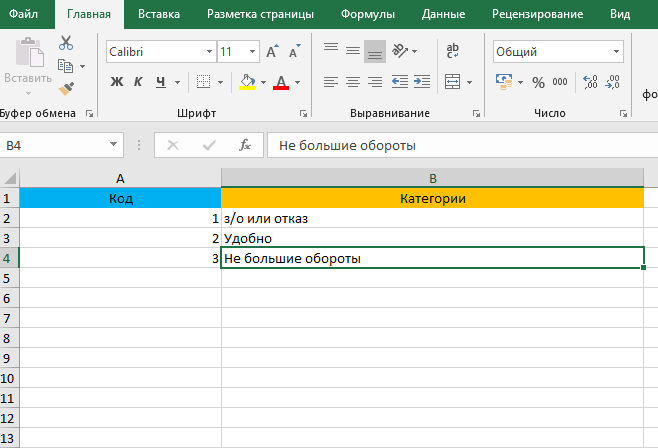
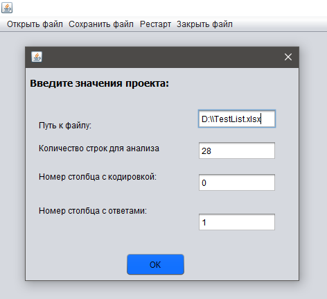
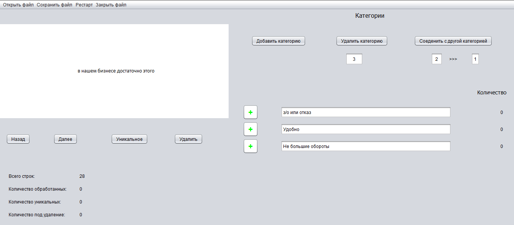
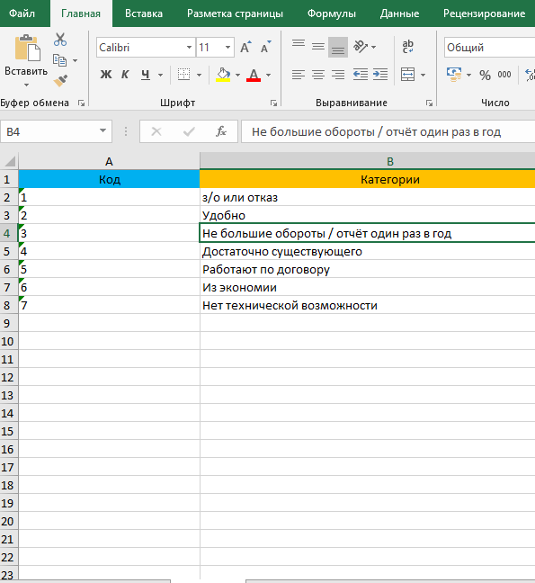
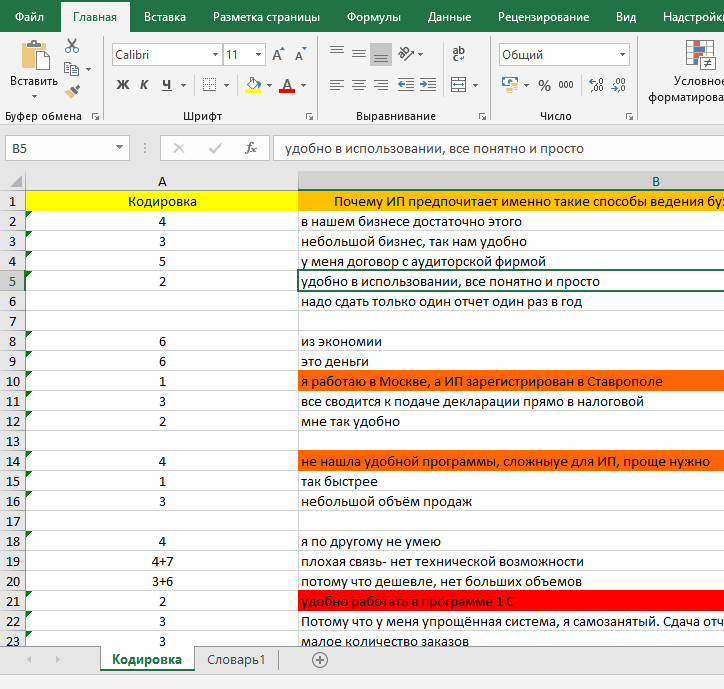

# Разработка Java приложения для быстрого и удобного кодирования информации
> Создание Java приложения, позволяющего кодировать информацию, то есть распределять её на определённые группы (категории).

> Основные возможности (функции) программы:
- импорт строк из файла excel
- добавление / редактирование / слияние / удаление категорий
- цветовая индикация выбранных категорий
- отображение актуального количества строк в категории
- добавление / удаление строки из категории
- взятие / отображение строк 
- сохранение состояния строки
- выделение цветом (уникальность, под удаление) строки
- актуальное отображение общего количества, обработанных, уникальных и под удаление строк
- экспорт обработанных строк и кодированных категорий в файл excel

> Классы программы:
- **MainWindow.class** – главный класс, реализует события, связанные с действием мыши, а также запуск программы
- **CooperationExcel.class** – класс, реализующий импорт и экспорт данных в Excel, посредствам подключения библиотеки Apache POI
- **Categories.class** - класс, реализующий операции, связанные с категориями, а также описывающий «значение» контейнера Map, структуры HashMap с именем «catigoriesMap»
- **Lines.class** – класс, реализующий операции, связанные со строками
- **Description.class** – класс, описывающий «значение» контейнера Map, структуры HashMap с именем «strokiMap»
- **OpenModal.class** – класс, реализующий дочернее модальное окно для ввода пользовательских настроек

> Структура классов и их методов представлена на рисунке ниже:

> Кратко рассмотрим пример работы программы. На начальном этапе имеем excel файл, в котором содержатся строки, которые необходимо закодировать, а также второй лист, где расположены категории: 

> Затем открываем Java приложение, вводим первоначальные настройки:

> После нажатия кнопки «ОК» открывается окно следующего вида: 

> Присвоим некоторым строкам определённые категории и отнесём их, как уникальные или под удаление, а также нажмём кнопку «сохранить файл», соответственно получим excel файл следующего вида:

